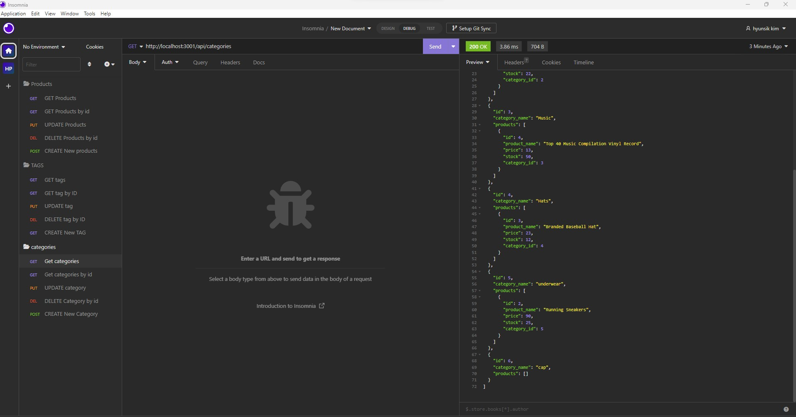

# ORM-E-commerce-Back-End

## Description

This project was created to create an application to build the back end for an e-commerce site. It is builted using MySQL2, Express, Sequelize and dotenv.

I created a E-commerce Back End with using the mobules in npm package that meets certain criteria.

This app runs in the terminal and take a working Express.js API and configure it to use Sequelize to interact with a MySQL database.

I learned how to get data from data base and post data from data base, save the requested data into data base and am able to successfully create, update, and delete data in my database.

Also I learned how to use Insomnia to operate this application
 

## Installation

It is already installed all the modules that we need but if it isn't install MySQL2, Sequelize and dotenv by following commands. 
1. `npm init`
2. `npm install mysql2`
3. `npm install sequelize`
4. `npm install dotenv`

## Usage
How to operate : 
1. Please type "npm start" in teminal  
2. When it is connected, you can see the result by insomnia  

 

(screenshot image could be slitely different with the web application)

## Video
Firtst workthrough video (getting all datas) : https://drive.google.com/file/d/18wjNKqT5kexo8Q5xZW9YIzmAEaEq1nBD/view  
Second workthrough video (getting a single data by id) : https://drive.google.com/file/d/1LCwfnttifoOl6xwQdpw4-fYrBAal0EdR/view 
Third workthrough video (POST, PUT, and DELETE routes for categories) : https://drive.google.com/file/d/1ALw-kfQgOUgI9mSQRWIYD_09m39CBDND/view 

## Credits

N/A

## License

N/A